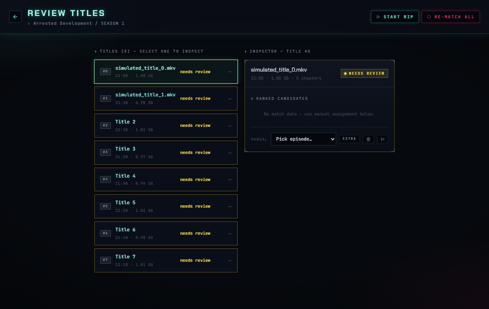
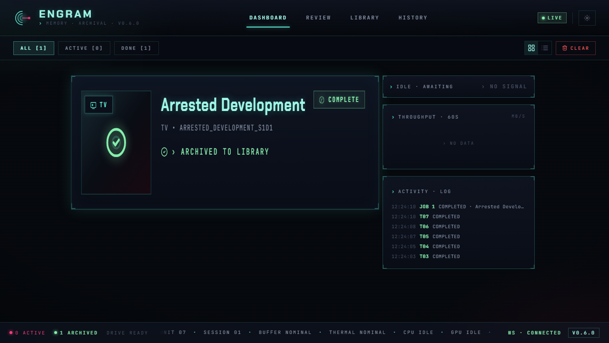

<p align="center">
  
</p>

<h1 align="center">Engram</h1>

<p align="center">
  Disc ripping and media organization with a reactive web dashboard.
  <br />
  Monitors optical drives, rips with MakeMKV, identifies episodes via audio fingerprinting,
  <br />
  and files everything into your media library — automatically.
</p>

<p align="center">
  <a href="https://github.com/Jsakkos/engram/releases"></a>
  <a href="https://github.com/Jsakkos/engram/actions/workflows/ci.yml"></a>
  <a href="LICENSE"></a>
  <a href="https://github.com/Jsakkos/engram/releases"></a>
  <a href="https://github.com/Jsakkos/engram/releases"></a>
</p>

---

## Screenshots

<table>
  <tr>
    <td><br /><sub>Ripping a TV disc with real-time progress</sub></td>
    <td><br /><sub>Audio fingerprint matching with confidence scores</sub></td>
  </tr>
  <tr>
    <td><br /><sub>Human-in-the-loop episode review queue</sub></td>
    <td><br /><sub>Completed job with activity log</sub></td>
  </tr>
</table>

## Features

- **Automatic disc detection** — monitors optical drives and starts processing on insertion
- **Smart classification** — distinguishes TV shows from movies using duration analysis, TMDB lookup, and TheDiscDB; uses the MakeMKV disc name as a TMDB fallback for merged-word volume labels (e.g. `STRANGENEWWORLDS_SEASON3`)
- **Audio fingerprint matching** — identifies TV episodes via ASR transcription matched against subtitles
- **Subtitle downloads** — fetches subtitles via the OpenSubtitles.com REST API (preferred, free tier available) with Addic7ed as fallback
- **Real-time dashboard** — web UI with WebSocket live updates, progress tracking, and notifications
- **Human-in-the-loop** — review queue for low-confidence matches, unreadable disc labels, and ambiguous content with a pre-filled correction modal
- **Job history & analytics** — searchable archive of all completed/failed jobs with drill-down detail panel, processing timeline, and TheDiscDB metadata
- **TheDiscDB integration** — automatic disc identification via content-hash fingerprinting with persisted title mappings
- **Responsive design** — works on desktop and mobile with compact/expanded view modes

## Platform support

| Feature | Windows | Linux | macOS |
|---------|---------|-------|-------|
| Automatic drive detection | Yes | Yes | No |
| Staging folder auto-import | Yes | Yes | Yes |
| MakeMKV ripping | Yes | Yes | Yes |
| Episode matching (ASR) | Yes | Yes | Yes |
| Web dashboard & API | Yes | Yes | Yes |
| Tool auto-detection | Yes | Yes | Yes |
| TheDiscDB / TMDB lookup | Yes | Yes | Yes |

**Windows** has full automatic disc detection via kernel32 APIs. **Linux** has native optical-drive detection via `/sys/block` and `blkid`. On **macOS**, the backend and dashboard run fully, but disc insertion must be triggered via the staging import API.

On all platforms, Engram supports a **staging folder workflow**: drop a folder of pre-ripped MKV files into the staging directory and Engram will auto-detect, classify, match, and organize them. This is the primary workflow on systems without optical drives. See [Linux / macOS setup](docs/guide/linux-setup.md) for details.

## Prerequisites

- [MakeMKV](https://www.makemkv.com/) with a valid license
- A TMDB API Read Access Token (v4) from [TMDB](https://www.themoviedb.org/settings/api)
- If running from source: Python 3.11+ with [uv](https://docs.astral.sh/uv/), and Node.js 24

## Install

### Option A: Standalone executable (Windows)

Download `engram-windows-x64.zip` from the [Releases](https://github.com/Jsakkos/engram/releases) page, extract it, and run `engram.exe`. No Python or Node.js required — the Config Wizard opens in your browser on first launch.

### Option B: From source (all platforms)

```bash
git clone https://github.com/Jsakkos/engram.git
cd engram

# Backend
cd backend
uv sync
cd ..

# Frontend
cd frontend
npm install
cd ..
```

For GPU-accelerated transcription (optional):

```bash
cd backend
uv sync --extra gpu
```

Then start the two dev servers in separate terminals:

```bash
# Backend (API on port 8000)
cd backend
uv run uvicorn app.main:app

# Frontend (dashboard on port 5173)
cd frontend
npm run dev
```

Open http://localhost:5173 in your browser. See the [installation guide](docs/getting-started/installation.md) for distro-specific prerequisites and verification steps.

## Configuration

On first launch the Config Wizard walks you through setup: MakeMKV path, library paths, TMDB token, and more. Settings are stored in the database and editable from the Settings page.

- **TMDB**: the wizard asks for a **Read Access Token** (v4 auth) from your [TMDB API Settings](https://www.themoviedb.org/settings/api). This is the long JWT string starting with `eyJ...`, not the shorter v3 API Key.
- **OpenSubtitles** (optional): for more reliable subtitle downloads, configure an [OpenSubtitles.com](https://www.opensubtitles.com) account (free tier: 5 downloads/day; consumer API keys at [opensubtitles.com/consumers](https://www.opensubtitles.com/en/consumers)). Without credentials, Engram falls back to scraping Addic7ed.

An optional `backend/.env` file can override server-level defaults:

| Variable | Description | Default |
|----------|-------------|---------|
| `DATABASE_URL` | SQLite connection string | `sqlite+aiosqlite:///./engram.db` |
| `HOST` | Server bind address | `127.0.0.1` |
| `PORT` | Server port | `8000` |
| `DEBUG` | Enable simulation endpoints | `false` |

See the [configuration guide](docs/getting-started/configuration.md) for the full walkthrough and field reference.

## Documentation

Full documentation is published at **[jsakkos.github.io/engram](https://jsakkos.github.io/engram/)**.

- **Getting started** — [Installation](docs/getting-started/installation.md) · [Configuration](docs/getting-started/configuration.md) · [Simulation](docs/getting-started/simulation.md)
- **User guide** — [Dashboard](docs/guide/dashboard.md) · [Review Queue](docs/guide/review-queue.md) · [Job History](docs/guide/history.md) · [Linux / macOS setup](docs/guide/linux-setup.md)
- **Architecture** — [Overview](docs/architecture/overview.md) · [State Machine](docs/architecture/state-machine.md) · [WebSocket Protocol](docs/architecture/websocket.md)
- **API reference** — [REST Endpoints](docs/api/rest.md) · [Data Models](docs/api/models.md)
- **Development** — [Contributing](CONTRIBUTING.md) · [Testing](docs/development/testing.md) · [Subtitle Cache Build](docs/development/subtitle-cache.md)
- **[Changelog](CHANGELOG.md)**

## License

AGPL-3.0. See [LICENSE](LICENSE).

## Acknowledgments

- [MakeMKV](https://www.makemkv.com/) for disc decryption
- [mkv-episode-matcher](https://github.com/Jsakkos/mkv-episode-matcher) for audio fingerprinting
- [TheDiscDB](https://thediscdb.com/) for disc content-hash lookups
- [TMDB](https://www.themoviedb.org/) for media metadata and poster art
