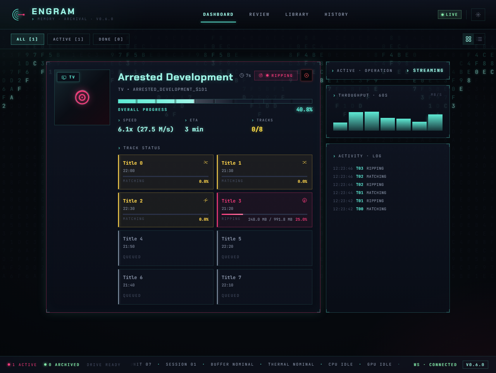
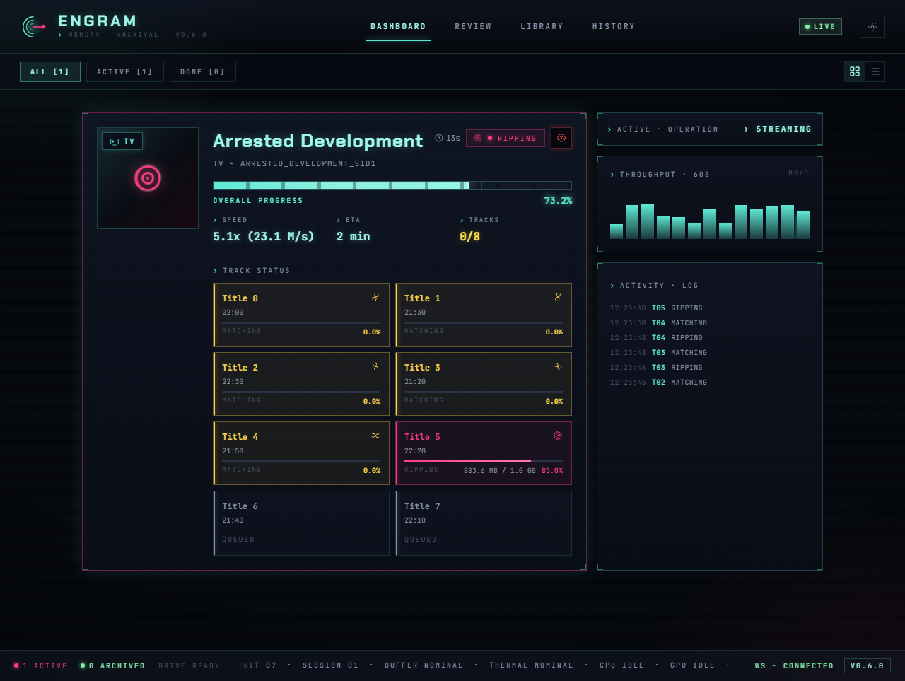
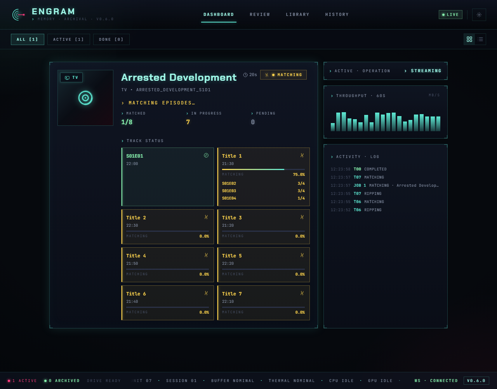

---
hide:
  - navigation
---

{ width="120" }

# Engram

**Disc ripping and media organization with a reactive web dashboard.**

Monitors optical drives, rips with MakeMKV, identifies episodes via audio fingerprinting,
and files everything into your media library -- automatically.

---

## Workflow

|  |
|:--:|
| *Ripping a TV disc with real-time progress* |

|  |
|:--:|
| *Track grid showing per-episode byte progress* |

|  |
|:--:|
| *Audio fingerprint matching with confidence scores* |

---

## Features

- **Automatic disc detection** -- monitors optical drives and starts processing on insertion
- **Smart classification** -- distinguishes TV shows from movies using duration analysis, TMDB lookup, and TheDiscDB; uses the MakeMKV disc name as a TMDB fallback for merged-word volume labels (e.g. `STRANGENEWWORLDS_SEASON3`)
- **Audio fingerprint matching** -- identifies TV episodes via ASR transcription matched against subtitles
- **Subtitle downloads** -- fetches subtitles via the OpenSubtitles.com REST API (preferred, free tier available) with Addic7ed as fallback
- **Real-time dashboard** -- web UI with WebSocket live updates, progress tracking, and notifications
- **Human-in-the-loop** -- review queue for low-confidence matches, unreadable disc labels, and ambiguous content with a pre-filled correction modal
- **Job history & analytics** -- searchable archive of all completed/failed jobs with drill-down detail panel, processing timeline, and TheDiscDB metadata
- **TheDiscDB integration** -- automatic disc identification via content hash fingerprinting with persisted title mappings
- **Responsive design** -- works on desktop and mobile with compact/expanded view modes

## Platform Support

| Feature | Windows | Linux | macOS |
|---------|---------|-------|-------|
| Automatic drive detection | Yes | Yes | No |
| Staging folder auto-import | Yes | Yes | Yes |
| MakeMKV ripping | Yes | Yes | Yes |
| Episode matching (ASR) | Yes | Yes | Yes |
| Web dashboard & API | Yes | Yes | Yes |
| Tool auto-detection | Yes | Yes | Yes |
| TheDiscDB / TMDB lookup | Yes | Yes | Yes |

**Windows** has full automatic disc detection via kernel32 APIs. **Linux** has native optical-drive detection via `/sys/block` and `blkid`. On **macOS**, the backend and dashboard run fully, but disc insertion must be triggered via the staging import API. On all platforms, a **staging folder workflow** lets you drop pre-ripped MKV files into the staging directory for automatic classification, matching, and organization.

---

[Get Started](getting-started/installation.md){ .md-button .md-button--primary }
[API Reference](api/rest.md){ .md-button }
[Architecture](architecture/overview.md){ .md-button }
[Brand System](development/brand.md){ .md-button }

